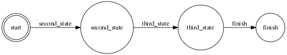

PHP State Machine / FSM / Acceptance Automata

 [](https://www.versioneye.com/user/projects/56b0dda83d82b90032bfff16?child=summary) [](https://packagist.org/packages/mothership/state_machine) [](https://packagist.org/packages/mothership/state_machine) [](https://packagist.org/packages/mothership/state_machine) [](https://packagist.org/packages/mothership/state_machine)
-----------------------------------------
A PHP based state machine implementation.

For more informations visit the [website](http://mothership-gmbh.github.io/state_machine)

#Features
- Create a FSM-compatible state machine
- Define your states, transitions and conditions completely in a configuration file. Currently only supports YAML
- NO additional logic is needed to process the transitions. The state machine will automatically try to detect valid transitions
- Render a graphic image that shows the behaviour of the state machine.
      
#Tests
You can run the unit tests with the following command:

    $ cd path/to/Mothership/Component/StateMachine/ #check your path
    $ composer install
	$ phpunit

#Installation

You can use composer to directly install in in your project. Do not use the master branch but only tagged versions.

```
"require": {
	"mothership/state_machine": "v1.0.2"
}

```

Then just run *composer install*

	$ composer install

##Requirement for rendering the graph

The StateMachine render graph functionality depends on the *graphviz* library. On os with apt just install it with the package managment

```
sudo apt-get install graphviz
```

#Usage

The state machine needs three files to be able to run:

1. A concrete state machine
2. The yaml configuration file
3. A workflow definition

##Quickstart

In case you have everything or just want to skip the more detailed parts, take a look at this directory within this repository:

```
/src/Examples/Simple/SimpleStateMachine.php
```

```
$stateMachine = new \Mothership\StateMachine\Examples\Simple('workflow.yml');
$stateMachine->run();
```

##1. The concrecte state machine

There is no concrete StateMachine implementation in this library, except the examples. However the implementation is very easy and in fact just an inheritance of the abstract class.

```
// set your own namespace
namespace Mothership\StateMachine\Examples\Simple;

class SimpleStateMachine extends \Mothership\StateMachine\StateMachineAbstract
{
// that's all!
}
```

##2. The yaml configuration file

The yaml configuration file is the most important file as it describes various business cases. You will find more advanced use cases later. For the beginning take a look at the following workflow. 



By the way: the graph has been rendered with graphviz. You can also easily render it by your own with this command:

```
$stateMachine->renderGraph('/your/path/file.png');
```

If you are familiar with the concepts of a state machine, you will know that a state machine contains

* a defined start
* a defined end
* a number of transitions
* a set of various states

Let's see, how the *configuration file* could look like, by inspecting the ```workflow.yml```:

```
class:
  name: Mothership\StateMachine\Examples\Simple\SimpleWorkflow
  args: []

states:
  start:
    type: initial
  second_state:
    type: normal
    transitions_from: 	[start]
    transitions_to: 	[second_state]
  third_state:
    type: normal
    transitions_from: 	[second_state]
    transitions_to: 	[third_state]
  finish:
    type: final
    transitions_from:  [third_state]
    transitions_to:    [finish]

```
###Good to know


* Every state, except *start* needs to be implemented as a method. For example the state with the name *second_state* expects a method named ```second_state()``` in the *workflow class*.
* The name of the transitions is always equals to the name of the ```transitions_to``` field. If there is an condition, the transition name will also be changed.
* You do not need to implement any programming logic for state transitions.
* The possible types of the state can be *initial*, *normal* or *final*.

##3. The workflow class

While the *configuration file* defines the possible transitions of the automata, the workflow class contains the possible transitions. Let's check this code:

```
namespace Mothership\StateMachine\Examples\Simple;

use Mothership\StateMachine\WorkflowAbstract;

class SimpleWorkflow extends WorkflowAbstract
{

    function second_state()
    {

    }

    function third_state()
    {

    }

    function finish()
    {
    }
}
```

* There is *no* method ```start()``` as this state will never be executed but is just a starting point
* The basic methods do not return any value. More advanced methods can for example return a boolean value or any string. This important for more advanced use cases.
* The name of the class *MUST* match the name of the class in the configuration file

#Render the graph
It is recommended to render your workflow as a graph, so that you will get visual support.

```
$state_machine = new StateMachine();
$state_machine = $state_machine->renderGraph($path, false);
```

**$paht**: path where the state machine will save the image

**true/false**: if you want that after the render the state machine exits (default is true)

#Advanced Use Cases

Let's assume a more advanced workflow like that one: [Advanced Workflow](./src/Examples/Advanced/Workflow.yml). The rendered graph will look like the following:


We will go through smaller examples to discuss the different transition types.

##Conditionals

Check the transition ```product_has_media_gallery``` and ```create_media_gallery```|```get_images```

|  Start | Condition  | Target  |
|---|---|---|
| product_has_media_gallery  |  true | create_media_gallery  |
| product_has_media_gallery  |  false | get_images |

As you can see, you need to have a condition *AFTER* the *start* state. This means that the state ```product_has_media_gallery``` needs to return a boolean value *true* OR *false*. To be able to do this, you need to update your *yaml configuration* like this:

```
  product_has_media_gallery:
    type: normal
    transitions_from: [download_directory_exist]
    transitions_to:   [product_has_media_gallery]

  create_media_gallery:
    type: normal
    transitions_from: [{status: product_has_media_gallery, result:  false}]
    transitions_to:   [create_media_gallery]

  get_images:
    type: normal
    transitions_from: [{status: product_has_media_gallery, result:  true}, create_media_gallery]
    transitions_to:   [get_images]

```

* The conditions are AlWAYS set in the target transition
* Even if we use BOOLEAN values here, you can actually also return a STRING! This is valid as well:

	```
    transitions_from: [{status: product_has_media_gallery, result:  'yes, okay'}]
	```
* The state ```get_images``` can be processed with two different transitions.

##Loops

Loops are very useful if you need to process a large set of data. The pattern is pretty simple. Take a look at the states ```process_images```, ```has_more``` and ```finish```.

If there is more to process, then continue to ```process_images```, otherwise ```finish```. As a matrix this would be:

|  Start | Condition  | Target  |
|---|---|---|
| has_more  |  true | process_images  |
| has_more  |  false | finish |

Just do it like that:

```
  process_images:
    type: normal
    transitions_from: [get_images, {status: has_more, result:  true}]
    transitions_to:   [process_images]
    
  has_more:
    type: normal
    transitions_from: [assign_image]
    transitions_to:   [has_more]

  finish:
    type: final
    transitions_from:  [{status: has_more, result:  false}]
    transitions_to:  [finish]

```


#More examples

Check the directory ```./src/Examples``` to explore more advanced examples by your own. You can also add new state machines into this directory, to automatically run unit tests.


#Tests
- Run test from root directory: ```phpunit --coverage-text```
- You can add your State machine in the ```./src/Examples``` folder and it will be automatically tested with the 
command about. **Just use the same conventions name space**

#Notes
- **Mothership StateMachine** is inspired by [Finite/StateMachine](https://github.com/yohang/Finite) presents in this extension
- [dev-master api](http://mothership-gmbh.github.io/state_machine/api/dev-master/)
